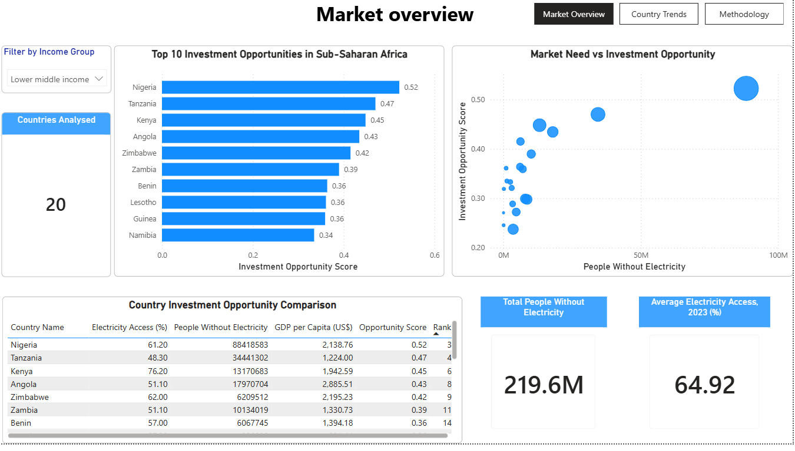
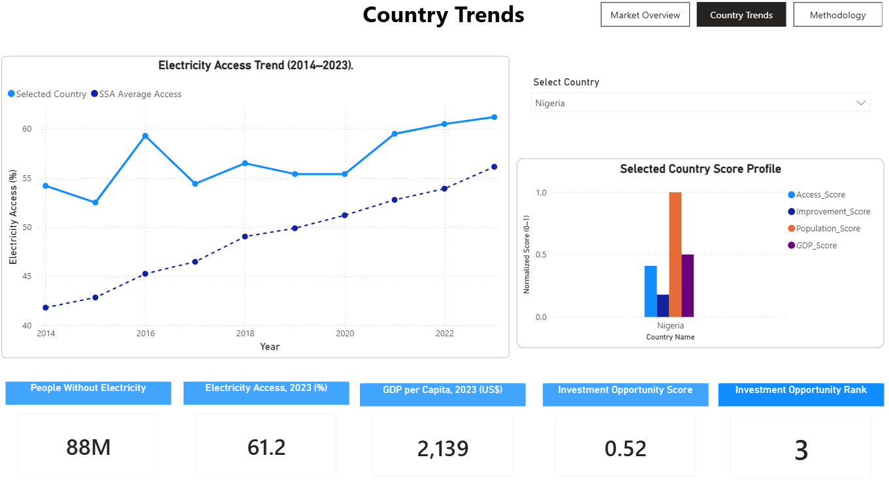
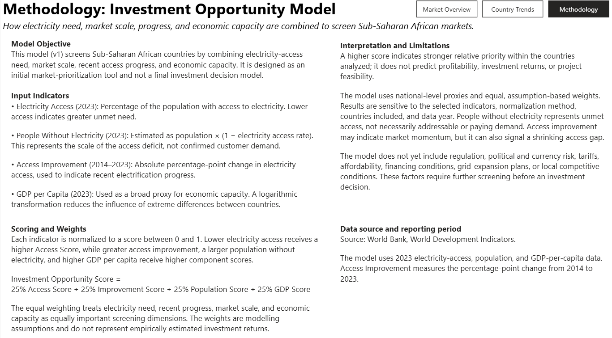

# Energy Market Intelligence for Sub-Saharan Africa

## Project Overview

This project uses World Bank data to screen Sub-Saharan African countries for decentralized-energy and mini-grid market opportunities.

It combines electricity-access need, market scale, recent electrification progress, and economic capacity in a reproducible Python model, with results presented through an interactive Power BI dashboard.

The model is intended for initial market prioritization—not as a substitute for detailed commercial, regulatory, or project-level due diligence.

---

## Business Question

Which Sub-Saharan African countries combine substantial electricity need, meaningful market scale, positive electrification progress, and sufficient economic capacity to warrant deeper investment screening?

---

## Project Development

### Version 1: Electricity-Access Priority Model

Version 1 focused on identifying countries with the greatest electricity-access challenge.

The analysis included:

* Electricity access rates from 2014 to 2023
* Absolute and relative access improvement
* Population estimates
* Estimated population without electricity
* Normalized access, improvement, and population scores
* Sensitivity testing under alternative weighting assumptions

### Version 2: Investment Opportunity Model

Version 2 introduced GDP per capita as a broad proxy for economic capacity.

Each component is normalized to a score between 0 and 1:

* **Access Score:** Lower electricity access receives a higher score
* **Improvement Score:** Greater access improvement receives a higher score
* **Population Score:** More people without electricity receives a higher score
* **GDP Score:** Higher log-transformed GDP per capita receives a higher score

The final model uses equal weights:

[
\text{Investment Opportunity Score} =
0.25(\text{Access Score}) +
0.25(\text{Improvement Score}) +
0.25(\text{Population Score}) +
0.25(\text{GDP Score})
]

Equal weighting is a modelling assumption. It does not represent empirically estimated investment returns.

---

## Power BI Dashboard

The dashboard contains three interactive pages.

### 1. Market Overview

Provides a regional view of:

* Total population without electricity
* Average electricity access
* Country opportunity rankings
* Market need versus investment opportunity
* Income-group filtering
* Detailed country comparisons



### 2. Country Trends

Allows users to select an individual country and examine:

* Electricity-access trends from 2014 to 2023
* Comparison with the Sub-Saharan African average
* Population without electricity
* GDP per capita
* Investment opportunity score and rank
* The four component scores driving the ranking



### 3. Methodology

Documents the model objective, indicators, normalization logic, weights, interpretation, data sources, and limitations.



The interactive Power BI file is available here:

[Download the Power BI dashboard](dashboard/energy_investment_dashboard_v2.pbix)

---

## Selected Findings

* The countries analysed have an estimated **588 million people without electricity** based on 2023 population and electricity-access data.
* **Nigeria ranks third** under the Version 2 equal-weight investment opportunity model.
* A large electricity-access deficit does not automatically indicate an attractive investment market. Market scale, recent progress, and economic capacity materially affect the rankings.
* The results are relative to the countries, indicators, data years, normalization method, and weights included in the model.

---

## Data Sources

Data were obtained from the World Bank’s World Development Indicators:

* **Access to electricity (% of population):** `EG.ELC.ACCS.ZS`
* **Population, total:** `SP.POP.TOTL`
* **GDP per capita (current US$):** `NY.GDP.PCAP.CD`

The model uses 2023 data for electricity access, population, and GDP per capita. Access improvement is measured as the percentage-point change between 2014 and 2023.

People without electricity is estimated as:

[
\text{Population} \times
\left(1-\frac{\text{Electricity Access Rate}}{100}\right)
]

---

## Tools and Technologies

* Python
* Pandas
* NumPy
* Matplotlib
* Jupyter Notebook
* Power BI
* Git and GitHub

---

## Repository Structure

```text
energy-market-intelligence/
├── dashboard/
│   ├── energy_investment_dashboard_v2.pbix
│   └── screenshots/
├── data/
│   ├── raw/
│   └── processed/
├── notebooks/
│   └── 02_investment_model.ipynb
├── src/
│   ├── clean_data.py
│   ├── load_data.py
│   ├── pipeline.py
│   ├── scoring.py
│   └── visualization.py
├── requirements.txt
└── README.md
```

---

## Limitations

The opportunity score is a relative screening indicator. It does not predict profitability, investment returns, customer demand, or project feasibility.

The current model:

* Uses national-level indicators
* Applies assumption-based equal weights
* Treats GDP per capita as only a broad economic proxy
* Estimates unmet access rather than addressable or paying demand
* Does not yet incorporate regulation, political risk, currency risk, tariffs, affordability, financing conditions, grid-expansion plans, or local competition

Countries identified as priorities therefore require additional commercial and regulatory assessment.

---

## Planned Extension

Version 3 will extend the screening framework to evaluate market readiness and investment feasibility using indicators such as:

* Mini-grid and decentralized-energy regulation
* Political and regulatory risk
* Currency and financing conditions
* Electricity tariffs and affordability
* Grid-expansion risk
* Local competition and implementation capacity
